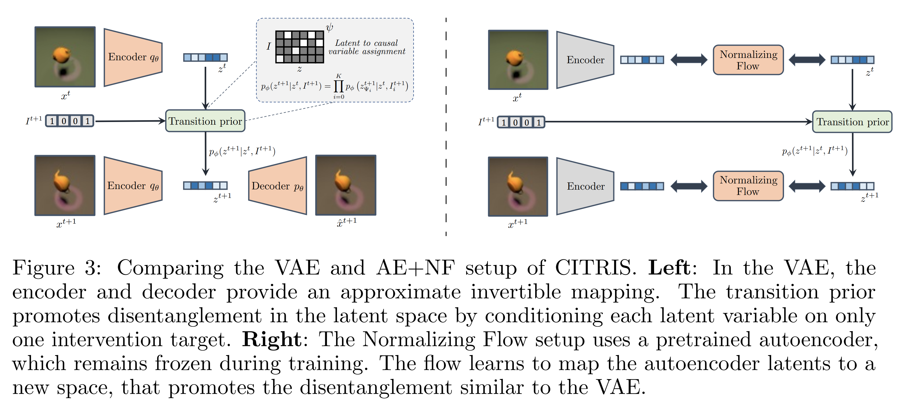
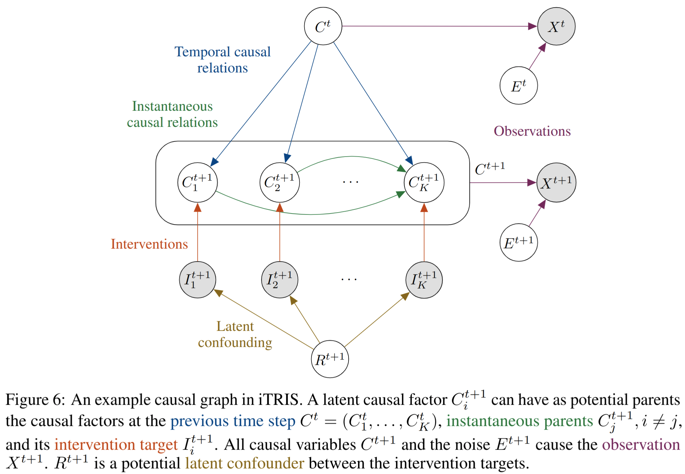
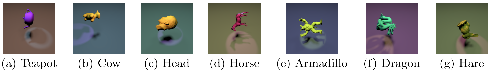
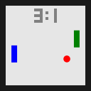
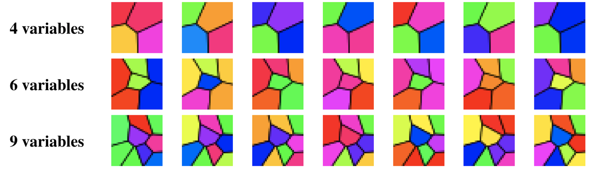

# Causal Identifiability from (Instantaneous) Temporal Intervened Sequences

**CITRIS**: [](https://arxiv.org/abs/2202.03169)
[](https://zenodo.org/record/6637749#.YqcWCnVBxCA)    

**iCITRIS**: 
[](http://arxiv.org/abs/2206.06169)
[](https://zenodo.org/record/6570441#.Yqgr_9JBxCA)

This is the official code repository for the papers **"CITRIS: Causal Identifiability from Temporal Intervened Sequences"** (ICML 2022) and **"Causal Representation Learning for Instantaneous and Temporal Effects in Interactive Systems"** (ICLR 2023), by Phillip Lippe, Sara Magliacane, Sindy Löwe, Yuki M. Asano, Taco Cohen, and Efstratios Gavves.

## Paper summary

### CITRIS: Causal Identifiability from Temporal Intervened Sequences 

Understanding the latent causal factors of a dynamical system from visual observations is a crucial step towards agents reasoning in complex environments. In this paper, we propose CITRIS, a variational autoencoder framework that learns causal representations from temporal sequences of images in which underlying causal factors have possibly been intervened upon. In contrast to the recent literature, CITRIS exploits temporality and observing intervention targets to identify scalar and multidimensional causal factors, such as 3D rotation angles. Furthermore, by introducing a normalizing flow, CITRIS can be easily extended to leverage and disentangle representations obtained by already pretrained autoencoders. Extending previous results on scalar causal factors, we prove identifiability in a more general setting, in which only some components of a causal factor are affected by interventions. In experiments on 3D rendered image sequences, CITRIS outperforms previous methods on recovering the underlying causal variables. Moreover, using pretrained autoencoders, CITRIS can even generalize to unseen instantiations of causal factors, opening future research areas in sim-to-real generalization for causal representation learning.

<p align="center">

</p>

### Causal Representation Learning for Instantaneous and Temporal Effects in Interactive Systems

Causal representation learning is the task of identifying the underlying causal variables and their relations from high-dimensional observations, such as images. Recent work has shown that one can reconstruct the causal variables from temporal sequences of observations under the assumption that there are no instantaneous causal relations between them. In practical applications, however, our measurement or frame rate might be slower than many of the causal effects. This effectively creates "instantaneous" effects and invalidates previous identifiability results. To address this issue, we propose iCITRIS, a causal representation learning method that can handle instantaneous effects in temporal sequences when given perfect interventions with known intervention targets. iCITRIS identifies the causal factors from temporal observations, while simultaneously using a differentiable causal discovery method to learn their causal graph. In experiments on three video datasets, iCITRIS accurately identifies the causal factors and their causal graph.

<p align="center">

</p>

## Requirements

The code is written in PyTorch (v1.10) and Python 3.8. Higher versions of PyTorch and Python are expected to work as well.
Further, the code base makes use of PyTorch Lightning (v1.6) to structure the training code.

We recommend to use conda for installing the requirements. If you haven't installed conda yet, you can find instructions [here](https://www.anaconda.com/products/individual). The steps for installing the requirements are:

1. Create a new environment from the provided YAML file:
   ```setup
   conda env create -f environment.yml
   ```
   The environment installs PyTorch with CUDA 11.2. Adjust the CUDA version if you want to install it with CUDA 10.2, or remove it from the environment file if you want to install it on a CPU-only system.
   
2. Activate the environment
   ```setup
   conda activate citris
   ```

## Datasets

All datasets used in CITRIS and iCTIRIS are synthetic and can be generated by the code provided in this repository, or downloaded here: [purely temporal datasets](https://zenodo.org/record/6637749#.YqcWCnVBxCA) (Temporal Causal3DIdent, Interventional Pong, Ball-in-Boxes) and [instantaneous datasets](https://zenodo.org/record/6570441#.Yqgr_9JBxCA) (Instantaneous Temporal Causal3DIdent, Causal Pinball). 
For generating them yourself, see the specific instructions for each dataset below.

### (Instantaneous) Temporal Causal3DIdent 
The (Instantaneous) Temporal Causal3DIdent dataset is a collection of 3D object shapes, which are observed under varying positions, rotations, lightning, and colors. Overall, this dataset contains 7 (multidimensional) causal factors. The dynamics for generating a sequence of causal factors for the (Instantaneous) Temporal Causal3DIdent dataset can be found in `data/data_generation_causal3dident.py`. These latents can be used as input to a Blender generation pipeline, for which we made use of another public [codebase](https://github.com/brendel-group/cl-ica). We can provide the preprocessed 7 object shapes upon request (see contact below).

<p align="center">

</p>

### Causal Pinball 
The Causal Pinball environment implements the simplified, real-world game dynamics of Pinball. This dataset considers 5 causal variables with instantaneous effects: the paddle position left, the paddle position right, the ball (velocity and position), the state of all bumpers, and the score. The dataset generation file for the Causal Pinball dataset can be found in `data/data_generation_pinball.py`. The image rendering is based on matplotlib. To generate the dataset which was used for the experiments in the paper, you can run `python data_generation_pinball.py --output_folder pinball/`, where `pinball/` is the folder all the data is saved in. This dataset can be directly used in the training files.

<p align="center">

</p>

### Interventional Pong
The Interventional Pong environment is inspired by the game dynamics of Pong, where both paddle follow the policy of moving towards the ball, and the ball has slightly random movements. This dataset considers the 5 causal variables paddle left, paddle right, the ball position, the ball velocity, and the score. The dataset generation file for the Interventional Pong dataset can be found in `data/data_generation_interventional_pong.py`. The image rendering is based on matplotlib. To generate the dataset which was used for the experiments in the paper, you can run `python data_generation_interventional_pong.py --output_folder interventional_pong/`, where `interventional_pong/` is the folder all the data is saved in. This dataset can be directly used in the training files.

<p align="center">

</p>

### Voronoi benchmark
The Voronoi benchmark is a synthetic, flexible environment, which uses neural network to generate causal models of arbitrary instantaneous and temporal graphs. The causal variables are entangled by a normalizing flow, before being plotted as hues in a Voronoi diagram. The Voronoi diagram adds some visual complexity, and is randomly generated once (i.e. different seeds have different diagrams), but kept constant for the whole dataset. The dataset generation file for the Voronoi benchmark can be found in `data/data_generation_voronoi.py`. The image rendering is based on matplotlib. To generate the datasets which were used for the experiments in the submitted paper, you can use the parameters `graph_type` to select the random, chain, or full instantaneous graph, and `num_causal_vars` to select the graph size (4, 6, 9), and `single_target_interventions` to only intervene on one variable at a time. The datasets in the paper used the seeds 42, 43, 44, 45, and 46.

<p align="center">

</p>

### Ball-in-Boxes
The Ball-in-Boxes is a simple dataset for showcasing the concept of the minimal causal variables. The system consists of a ball which randomly moves within a box, but only under an intervention can swap between the two boxes. Thereby, the intervention does not affect the x-position in the box. Thus, one can only discover the box assignment as a causal variable, and not whether the inner x-position also belongs to it. The dataset generation for the Ball-in-Boxes dataset is implemented in the file [`data_generation_ball_in_boxes.py`](data_generation_ball_in_boxes.py). The image rendering is based on matplotlib. To generate the dataset in the appendix of the paper, you can run `python data_generation_ball_in_boxes.py --output_folder ball_in_boxes/`, where `ball_in_boxes/` is the folder in which all data will be saved in.

<p align="center">

</p>

## Running experiments

The repository is structured in three main folders:
* `experiments` contains all utilities for running experiments.
* `models` contains the code of CITRIS and the two baselines.
* `data_generation` contains all utilities for creating the dataset, as described before.

For running an experiment, the following steps need to be taken:
1. Train a Causal Encoder (`experiments/train_causal_encoder.py`) on the dataset. This is the supervised CNN used for the triplet evaluation.
2. If experiments with iCITRIS-NF/CITRIS-NF are planed, train an autoencoder (`experiments/train_ae.py`) on the dataset. This is the pretrained autoencoder from which the NF learns a causal representation.
3. Train the respective model (for VAEs, `experiments/train_vae.py`, or for NFs, `experiments/train_nf.py`) where the causal encoder, and eventually the autoencoder, are passed as arguments.

See the additional README in the folder `experiments/` for further details and examples for running experiments.

## Citation

If you use this code or find it otherwise helpful, please consider citing our work:
```bibtex
@inproceedings{lippe2022citris,
   title        = {{CITRIS}: Causal Identifiability from Temporal Intervened Sequences},
   author       = {Lippe, Phillip and Magliacane, Sara and L{\"o}we, Sindy and Asano, Yuki M and Cohen, Taco and Gavves, Stratis},
   year         = {2022},
   month        = {17--23 Jul},
   booktitle    = {Proceedings of the 39th International Conference on Machine Learning},
   publisher    = {PMLR},
   series       = {Proceedings of Machine Learning Research},
   volume       = {162},
   pages        = {13557--13603},
   url          = {https://proceedings.mlr.press/v162/lippe22a.html},
   editor       = {Chaudhuri, Kamalika and Jegelka, Stefanie and Song, Le and Szepesvari, Csaba and Niu, Gang and Sabato, Sivan}
}
```
```bibtex
@inproceedings{lippe2023causal,
    title        = {Causal Representation Learning for Instantaneous and Temporal Effects in Interactive Systems},
    author       = {Phillip Lippe and Sara Magliacane and Sindy L{\"o}we and Yuki M Asano and Taco Cohen and Efstratios Gavves},
    year         = 2023,
    booktitle    = {The Eleventh International Conference on Learning Representations},
    url          = {https://openreview.net/forum?id=itZ6ggvMnzS}
}
```

### Contact

If you have questions or found a bug, feel free to open a github issue or send a mail to p.lippe@uva.nl. 
